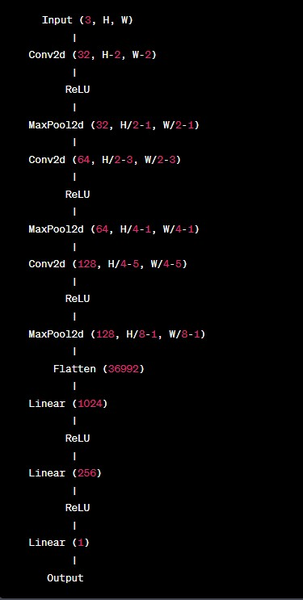
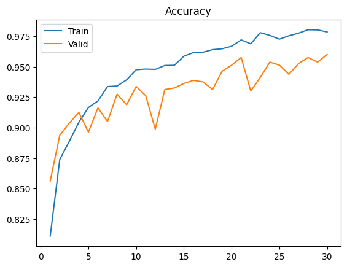
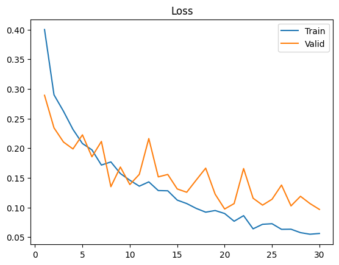

# Mask Detection Model

This repository contains code for a mask detection model implemented in PyTorch. The model is trained to classify whether a person is wearing a mask or not in an image.

## Installation

To run the code, you need to have Python 3.x and the following dependencies installed:

- torch
- torchvision
- matplotlib
- PIL

You can install the dependencies using pip:
  pip install -r requirements.txt

## Usage

1. Clone the repository:
  git clone https://github.com/your-username/mask-detection-model.git
  cd mask_no_mask_prediction

2. Download the dataset:

The code uses a face mask dataset that needs to be downloaded. You can download the dataset using the following cell in the notebook:
  ! kaggle datasets download omkargurav/face-mask-dataset
  

Extract the downloaded zip file and place the dataset files in the appropriate directories.

3. Run the Jupyter Notebook:

This will open the Jupyter Notebook in your browser. You can run the notebook cell by cell to train the model, evaluate its performance, and make predictions on test images.

4. Test the model:

To test the model on new images, you can add the image paths to the `test_image` dataset in the notebook and run the corresponding cells. The model will classify whether each person in the test images is wearing a mask or not.

## Model Architecture

The model architecture used in this code consists of several convolutional and fully connected layers. It takes an input image and outputs a prediction indicating whether the person is wearing a mask or not. The architecture details can be found in the notebook.

## Results

The notebook includes code to train the model, evaluate its performance on a validation set, and make predictions on test images. It also plots the training and validation accuracy and loss over epochs.

## License

This code is licensed under the [MIT License](LICENSE).

